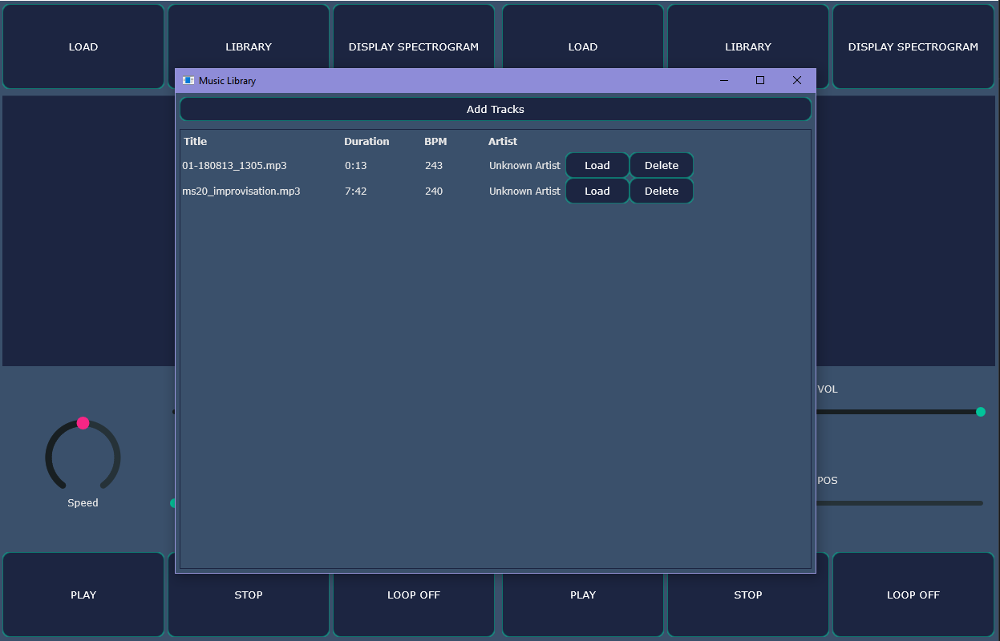
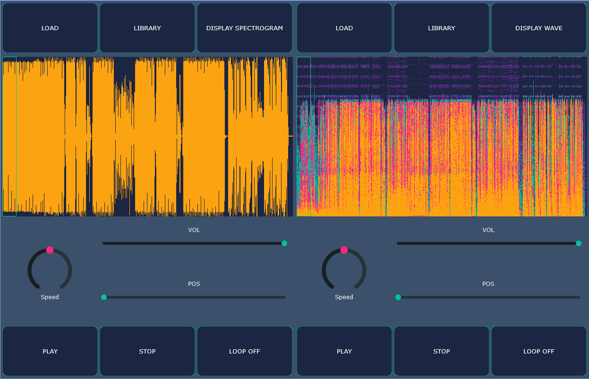

### Features

The app includes two separate decks which can receive different tracks or the same one.

1. Adding a new track directly in the deck
2. Save a new track in the library and load it from there
3. Library with persistent memory
4. Wave/Spectogram display
5. Change speed, volume, and position

Library:

Wave/Spectogram dsiplay for the same track:

### How to run the app

1. Install JUCE and Projucer: https://juce.com/download/
2. Install Visual Studio and add C++ development option
3. Open Projucer and add the .jucer file to it (File > Open)
4. Select the exporter as VS
5. Open project (File > Save Project and Open in IDE)
6. Build and run the project from VS
